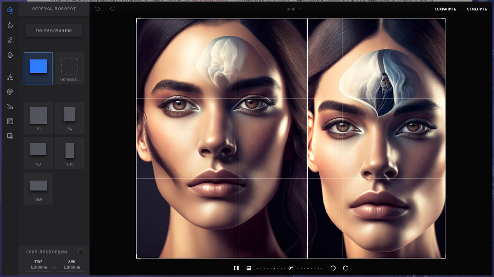
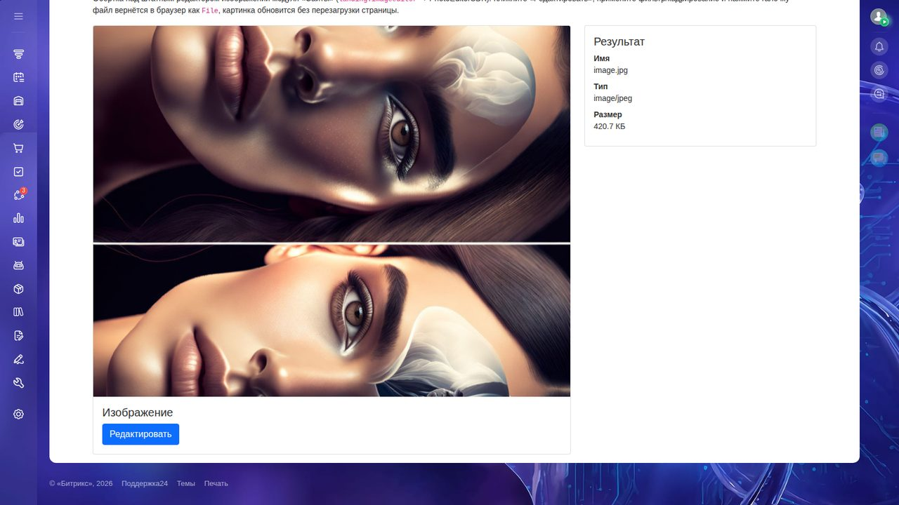

# bitrix24_image_editor

Обёртка над штатным редактором изображений Bitrix24 из модуля «Сайты»
(`landing.imageeditor` → `main.imageeditor` → PhotoEditorSDK) для использования
в собственных компонентах: открывает полноэкранный редактор (кадрирование,
поворот, фильтры, стикеры, текст) и возвращает результат как `File` (Blob).



Проверено на Bitrix24 **26.750.0** (main 26.750.0, 2026-08-27).

## Установка

- Скопируйте каталог `local/` в корень проекта.
- Убедитесь, что установлен модуль «Сайты» (`landing`) — редактор
  использует его ассеты и лицензию PhotoEditorSDK.

## Использование

Подключите расширение на странице:

```php
use Bitrix\Main\UI\Extension;

Extension::load('mtai.image_editor');
```

Откройте редактор для `` и работайте с результатом:

```js
const editor = new BX.Mtai.ImageEditor(document.getElementById('image_to_edit'));

const file = await editor.edit();
if (!file)
{
    // пользователь закрыл редактор без сохранения
    return;
}

// file — готовый File (Blob): отправьте его на сервер...
const data = new FormData();
data.append('ACTION', 'uploadUpdatedImage');
data.append('data', file);
const response = await fetch(location.href, { method: 'POST', body: data });
const result = await response.json();

// ...или сразу примените к элементу:
editor.updateElement(); // обновит src через URL.createObjectURL
```

Пример страницы — в [`example/index.php`](example/index.php):
карточка с картинкой, кнопка «Редактировать», панель с метаданными
полученного файла (имя / тип / размер).



## API

### `new BX.Mtai.ImageEditor(imageElement)`

| Метод | Возвращает | Описание |
|---|---|---|
| `edit()` | `Promise<File \| null>` | Открывает редактор. При сохранении резолвится `File` с отредактированным изображением, при закрытии без сохранения — `null` |
| `updateElement()` | — | Применяет результат последнего `edit()` к исходному `` через `URL.createObjectURL` (предыдущий object URL освобождается) |

Важно: штатный `BX.Landing.ImageEditor.edit()` **никогда не резолвит промис**,
если пользователь закрыл редактор без экспорта. Обёртка решает эту проблему
через событие `BX.Main.ImageEditor:close` — поэтому `.then()` не «зависает»,
а получает `null`.

## Сборка

Исходник — `local/js/mtai/image_editor/src/image_editor.js`, собранный бандл
уже лежит в `dist/`. Чтобы внести изменения и пересобрать:

```bash
npm install @bitrix/cli
npx bitrix build -p local/js/mtai/image_editor
```

Таргеты браузеров задаются в `.browserslistrc` (современные браузеры,
`async/await` без полифиллов). Обратите внимание: путь к расширению
передаётся флагом `-p` — без него CLI собирает весь каталог целиком.
